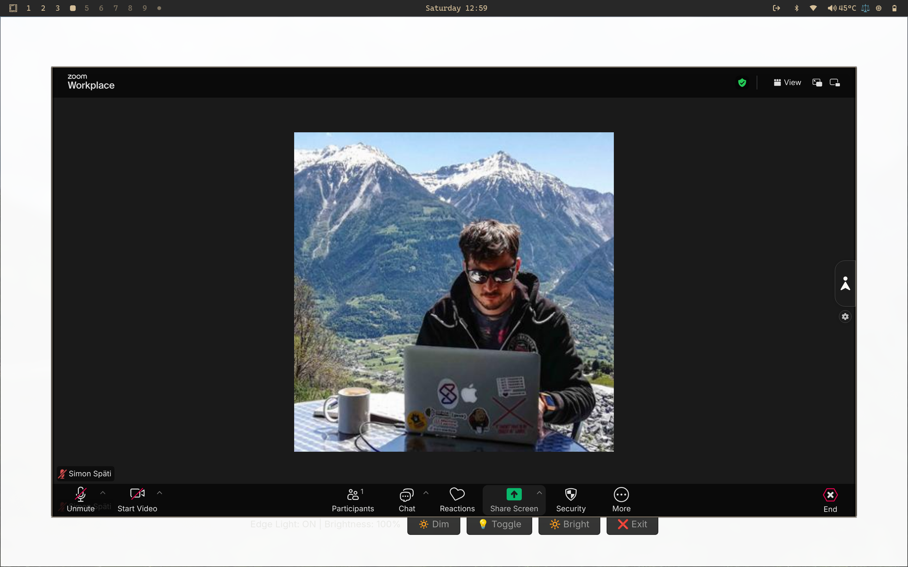
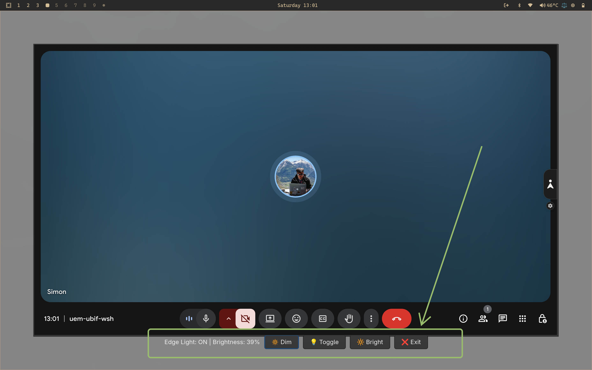

# Edge Light for Video Calls

A lightweight GTK4/Python application that adds a customizable glowing edge light effect around your screen. Perfect for ambient lighting during video calls on Linux with Hyprland.

You can use any app to put in the middle. Just start edge light, pop out your app you (Zoom, Google Keep, Teams, etc.) and put it in the middle.

Inspired by [shanselman/WindowsEdgeLight](https://github.com/shanselman/WindowsEdgeLight) and Apple's desk view camera announcement.

## Screnshots

**Full light with Zoom**:


**Shows Toggles and dimmed to 39% with Google Keep**:


## Features

- **Transparent Overlay**: Click-through design that doesn't interfere with your work
- **Customizable Brightness**: Adjust opacity from 20% to 100%
- **Toggle On/Off**: Quickly enable or disable the edge light effect
- **Always On Top**: Stays visible above all other windows
- **Keyboard Shortcuts**:
  - `Ctrl+Shift+L` - Toggle light on/off
  - `Ctrl+Shift+Up` - Increase brightness
  - `Ctrl+Shift+Down` - Decrease brightness
  - `Escape` - Exit application
  - `F1` - Show help
- **Control Panel**: Simple UI with buttons at the bottom of the screen

## Installation

### Prerequisites

**System packages** (Arch Linux):
```bash
sudo pacman -S gtk4 python-gobject python-cairo
```

**Python packages** (managed by UV):
- Install [UV](https://github.com/astral-sh/uv) if you don't have it

### Setup

1. Clone this repository
2. Run with UV (will auto-install Python dependencies):
```bash
uv run main.py
```

Or use the launcher script:
```bash
./launch-edgelight.sh
```

## Usage

1. Launch the application
2. A white border (80px) will appear around your screen edges
3. Use the control panel at the bottom or keyboard shortcuts to adjust
4. Press Escape to exit

**Tip**: Position your video call app window manually inside the border for the perfect lighting effect!

## Hyprland Integration

### Quick Launch Keybinding
Add to your Hyprland `bindings.conf`:
```conf
bind = SUPER SHIFT, Z, exec, /path/to/light-for-videocall/launch-edgelight.sh

```

The launcher script handles the full path to `uv` so it works from Hyprland keybindings.

### Window Rules for Auto-Positioning (Optional)
Automatically position Google Meet windows inside the border:
```conf
# Add to your Hyprland config (adjust size for your screen resolution and scale)
windowrulev2 = float, title:^(Meet)
windowrulev2 = size 1280 740, title:^(Meet)
windowrulev2 = move 80 80, title:^(Meet)
```

**Note**: Window sizes need to account for your monitor's scale factor. For example:
- Native 2880x1800 @ scale 2.0 = effective 1440x900
- Border 80px leaves 1280x740 for the window (in scaled pixels)

## Technical Details

- **GTK4** with PyGObject for native Linux support
- **Cairo** for smooth border rendering
- Works with **X11 and Wayland** (Hyprland compatible!)
- No XCB threading issues (unlike Tkinter)
- Fullscreen overlay with transparent background
- Border drawn at effective/scaled resolution
